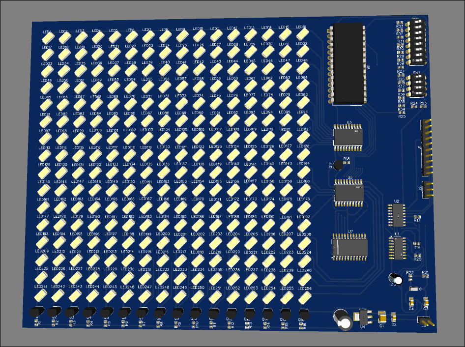

# Submission for Halflife's Week 1 PCB design

## CPULess Multiplexed LED Matrix 

This is a 16x16 LED display/matrix that's driven only by logic gates and an AT28C256 EEPROM to store an image, meaning there's no CPU or microcontroller that's controlling the LEDs.

I was motivated to make this to challenge myself to see what it would take and if I could actually design something complex that works, hopefully!

When the board powers on, a crystal oscillator is used alongside a 74HC4060 IC counter to generate a clock signal and to (in the future) automatically cycle between images using the counter that is its intended purpose.

That clock signal powers a 74HC590 8-bit counter that sets which row (or column, depending on how you want to look at it) is now to be displayed
A 74HC4514 demultiplexer IC actually enforces what the counter sets and powers on one row at a time (the multiplexing part). 

Simultaneously the counter value gets passed to the EEPROM as an address.
The EEPROM then returns the values of half a column of LEDs as an 8-bit value.
The value travels through one of two buffer ICs and through some transistors to power on the selected LEDs.

On the next clock cycle the other half is displayed by the EEPROM

Then a new row is addressed until it reaches row 16, where the counter resets and the process happens all over again

The 12 DIP switches allow me to select one of 4096 possible images to be displayed on the matrix
(It's noteworthy to say that my implementation only allows the LEDs to be either on or off.)